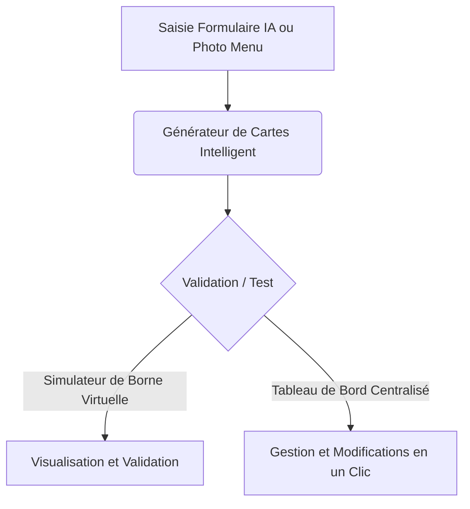

# Cahier des Charges Fonctionnel : Outil Intelligent de Génération de Cartes pour Bornes de Commande

## 1. Contexte et Enjeux Métiers

### Présentation de l'Entreprise
**Softavera** est un acteur spécialisé dans la digitalisation des points de vente, notamment à travers le déploiement et la maintenance de bornes de commande interactives pour les réseaux de restauration (franchises et indépendants).

### Contexte du Projet
Chaque borne de commande installée en restaurant a besoin d'une **carte numérique** (le catalogue de vente). Cette carte contient l'arborescence complète du menu : les catégories (burgers, boissons, desserts...), les produits, les prix, les descriptions, ainsi que toutes les étapes de personnalisation (cuisson de la viande, choix de la sauce, taille de la formule, suppléments).

### Problématique Actuelle
Aujourd'hui, la création et la mise à jour de ces cartes numériques sont effectuées manuellement par l'équipe Production et Support de Softavera. Ce processus présente plusieurs limites :
* **Très chronophage** : Saisir manuellement des dizaines de produits et relier chaque accompagnement à sa formule demande plusieurs heures de travail par restaurant.
* **Risque d'erreurs de saisie élevé** : Un simple oubli dans les liaisons ou une erreur de saisie peut bloquer le fonctionnement de la borne en restaurant ou empêcher la validation d'une commande.
* **Manque de réactivité** : La création de démonstrations pour des prospects ou le déploiement rapide de nouvelles franchises demandent un temps de saisie trop important.

---

## 2. Objectifs du Projet

L'objectif principal est de développer une **application web interne** simple et intuitive qui automatise et sécurise la création, la modification et la gestion de ces cartes de restaurants grâce à un assistant intelligent, éliminant ainsi toute saisie manuelle technique.

### Objectifs Métiers et Qualitatifs :
* **Gain de temps** : Réduire de manière extrêmement significative le temps nécessaire pour configurer un nouveau restaurant (passer de plusieurs heures à seulement quelques instants).
* **Fiabilité des données** : Éliminer complètement les dysfonctionnements des bornes causés par des erreurs manuelles de configuration.
* **Simplicité d'usage** : Permettre à n'importe quel collaborateur d'éditer une carte sans compétences techniques.
* **Validation immédiate** : Permettre de tester instantanément le rendu final sur une borne virtuelle avant envoi en production.

---

## 3. Description des Fonctionnalités Clés de l'Application

L'application s'articule autour de plusieurs modules fonctionnels :

### A. L'Assistant de Génération par Intelligence Artificielle
L'utilisateur n'a plus besoin d'écrire de fichiers informatiques. Il utilise un parcours guidé (assistant) :
1. Il saisit le nom du restaurant et choisit un concept culinaire (Burger, Pizza, Tacos, Asiatique, Café, etc.).
2. Il définit les options par défaut des formules (ex: supplément tarifaire pour les formules avec boisson et accompagnement).
3. Il sélectionne les catégories de produits qu'il souhaite vendre.
4. L'outil génère presque instantanément une carte de restaurant complète, cohérente et réaliste (avec des descriptions attractives et des prix logiques).

### B. Le Générateur à partir d'une simple Photo de Menu
Pour aller encore plus vite, l'utilisateur peut importer la photo d'un menu papier physique (ou une carte de restaurant au format image). 
* L'application lit et extrait automatiquement les textes de l'image (noms des plats, prix, descriptifs, allergènes).
* Elle structure ces données pour créer la carte numérique correspondante, évitant ainsi toute ressaisie manuelle.

### C. La Borne de Commande Virtuelle (Simulateur Intégré)
Pour chaque restaurant, l'application affiche à l'écran un **simulateur visuel interactif** prenant la forme d'une borne physique (tablette géante).
* **Test en conditions réelles** : Le collaborateur peut tester le parcours de commande comme s'il était un client en restaurant (choix "Sur Place" / "À Emporter", ajout des formules au panier, étapes de personnalisation des plats, panier dynamique, validation de la commande).
* **Vérification visuelle** : Cela permet de valider le rendu esthétique des plats, la cohérence des prix et la fluidité des choix avant de déployer la carte sur les vraies bornes des restaurants.

### D. La Bibliothèque et le Tableau de Bord
Un espace centralisé permet de gérer le parc de cartes numériques :
* **Recherche et Filtres** : Retrouver instantanément la carte d'un restaurant.
* **Lancement du Simulateur** : Lancer en un clic la borne virtuelle d'un restaurant pour vérification.
* **Modifications et Mises à jour** : Modifier en temps réel les informations d'un restaurant ou supprimer une carte devenue obsolète.

---

## 4. Profil des Utilisateurs Cibles

L'application s'adresse à différents profils au sein de Softavera :
1. **L'Équipe de Production et Déploiement** : Pour configurer rapidement les cartes numériques des nouveaux clients et déployer des franchises en quelques clics.
2. **L'Équipe Support Technique** : Pour modifier en urgence le prix d'un produit, ajouter une option ou ajuster une carte à la demande d'un restaurateur sans risque d'erreur.
3. **L'Équipe Commerciale** : Pour créer instantanément une borne de démonstration personnalisée aux couleurs et aux plats d'un prospect lors d'un rendez-vous de vente.

---

## 5. Bénéfices et Valeur Ajoutée pour l'Entreprise

* **Réduction drastique des coûts opérationnels** : Moins de temps passé sur la saisie manuelle libère du temps pour des tâches à plus forte valeur ajoutée.
* **Amélioration de la satisfaction client** : Les modifications de menus demandées par les restaurateurs sont appliquées et testées beaucoup plus rapidement.
* **Qualité et Stabilité** : Moins de réclamations liées à des dysfonctionnements de bornes en restaurant grâce aux tests instantanés sur la borne virtuelle.

---

## Évolutions Futures (Hors Périmètre Initial)

### Portail d'Édition Client (Espace Restaurateur)
Bien que le projet se concentre en priorité sur l'outil interne pour les équipes de Softavera, une évolution ultérieure consistera à offrir un accès sécurisé aux clients :
* **Autonomie du Restaurateur** : Un espace dédié permettra à chaque client de se connecter pour modifier lui-même les prix, descriptions ou la disponibilité des produits de sa carte.
* **Sécurité et Isolation** : Le client aura visibilité et accès uniquement sur les cartes de ses propres établissements.
* **Validation intégrée** : Le client pourra utiliser le simulateur de borne virtuelle pour prévisualiser ses modifications avant publication.
